# LiterNexus

LiterNexus 是一个本地运行的科研文献知识工作流工具，覆盖文献元数据采集、CSV 预览、SQLite 文献库沉淀、PDF 全文解析、知识问答、AI 综述生成、知识图谱和研究热点分析。V3.2.2 的重点是构建以 PDF 全文证据为基础、引用可追溯的个人科研知识库。

## 核心能力

- 多来源文献检索：Semantic Scholar、OpenAlex、Crossref、arXiv、PubMed、Springer Nature Meta API
- 多源补全与去重：按 DOI 和规范化标题合并结果，补齐摘要、期刊、引用数、PDF 链接等字段
- 文献库沉淀：把检索结果写入 `literature_library.sqlite`，支持长期滚动积累
- PDF 全文解析：支持上传 PDF、查看 PDF、调用 Marker 解析 Markdown、缓存全文片段
- 全文证据综述：支持“仅摘要”“仅全文证据”“摘要和全文证据”三种证据来源
- 知识图谱：支持基于当前 CSV、文献主题库或全库文献库构建“材料-工艺-组织-性能”关系图
- 研究热点：统计主题热点、关键词、作者、机构和双主题对比
- 本地优先：新安装的数据默认保存在本机 `LiterNexus_outputs/`；升级安装自动兼容原有 `ScholarFlow_outputs/`

## 界面预览

### 总览

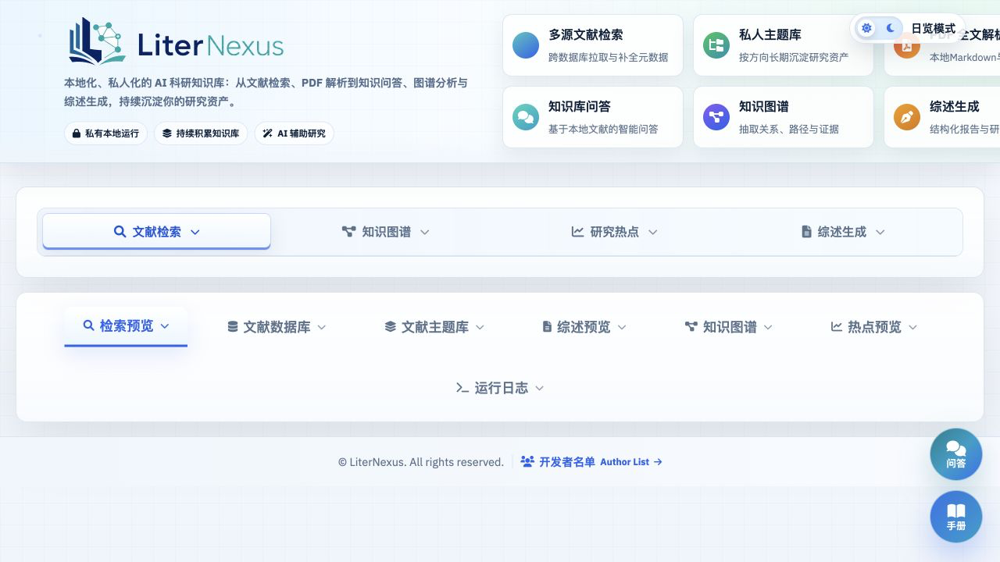

界面右下角提供“手册”悬浮球，点击后会在新页面打开用户手册，内容来自 `docs/USER_GUIDE.md`。

### 文献检索与数据预览

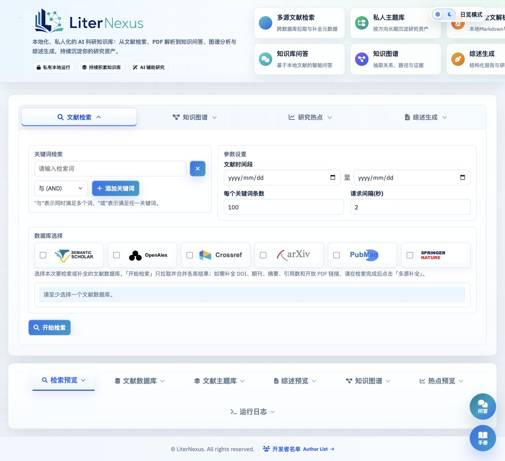

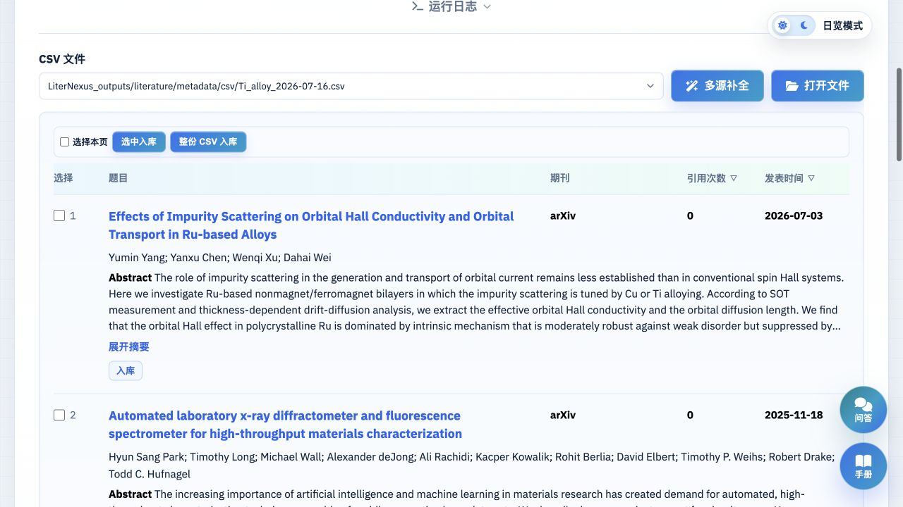

### 文献库与主题库

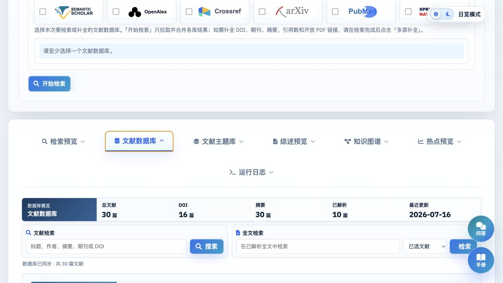

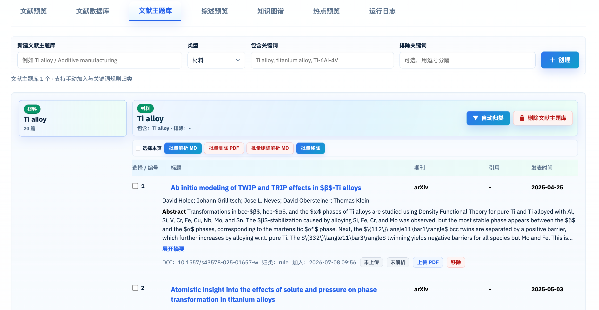

### 综述生成与预览

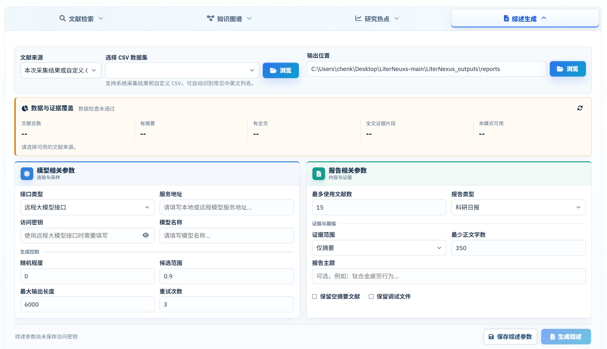

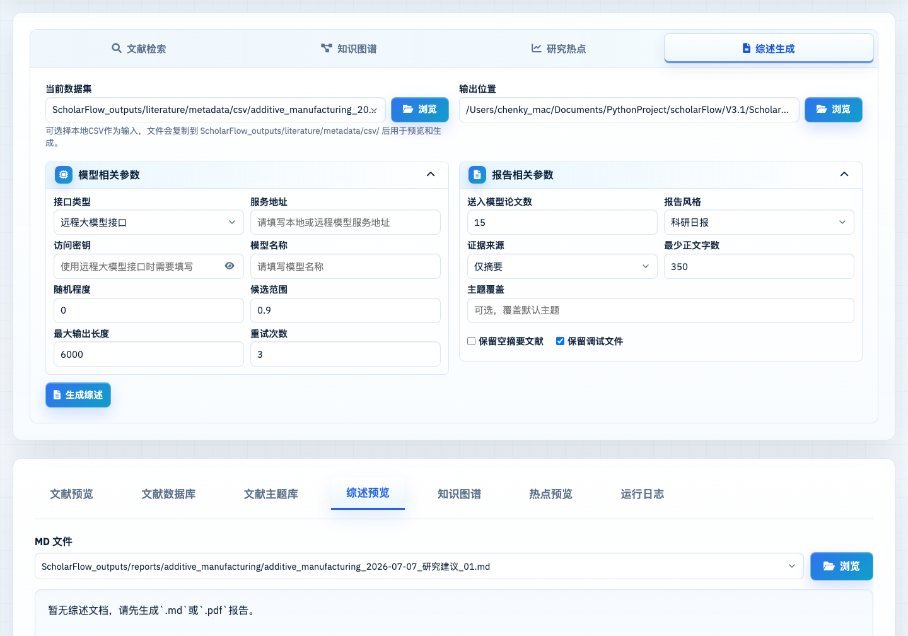

### 知识图谱

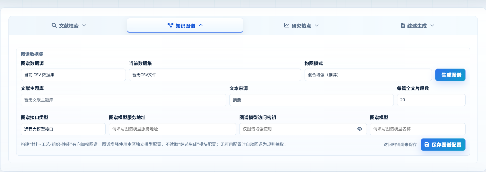

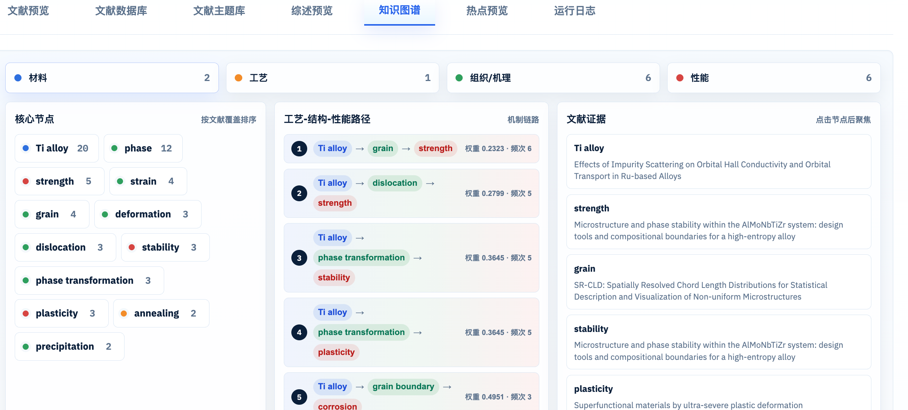
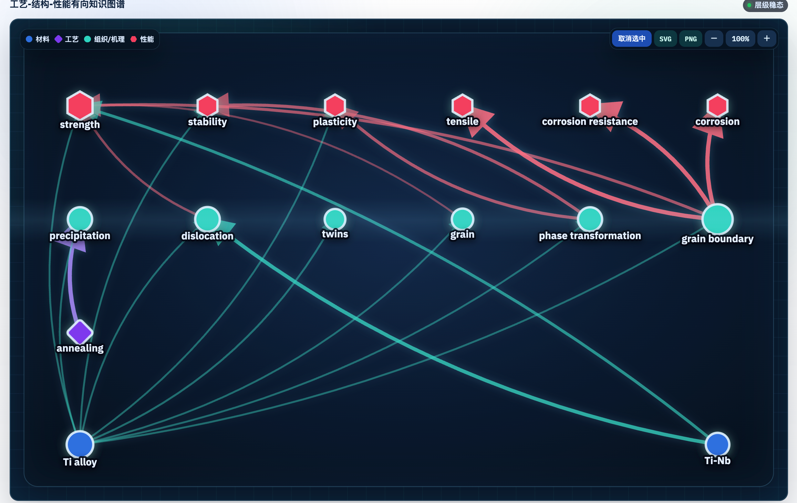

### 研究热点与日志

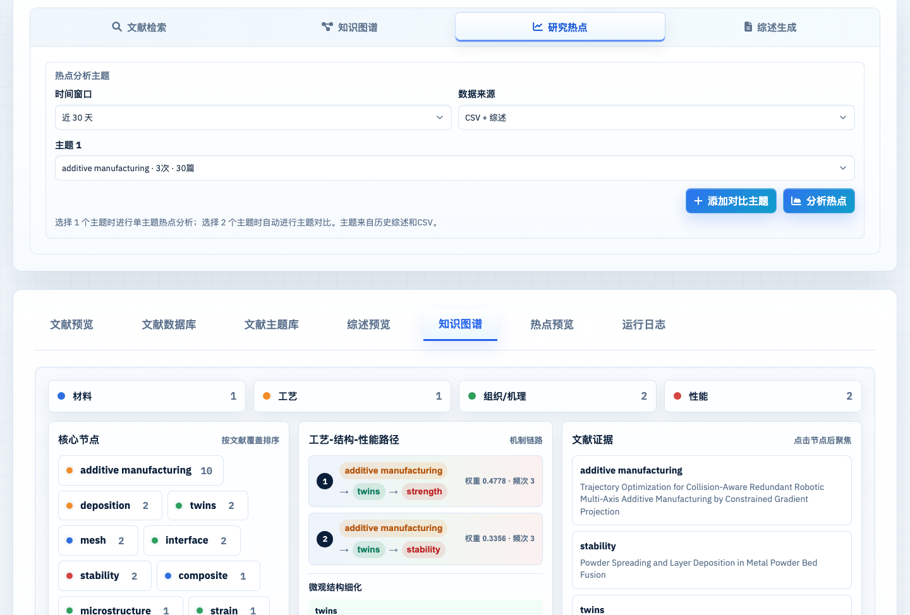

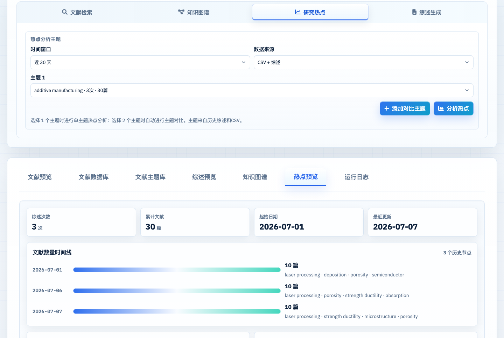


## 快速启动

### 1. 安装运行依赖

```bash
pip install -r requirements.txt
```

`requirements.txt` 当前包含：

```txt
pandas
requests
flask
flask-wtf
wtforms
marker-pdf
```

如需测试、Ruff 或 PyInstaller 打包，再安装开发依赖：

```bash
pip install -r requirements-dev.txt
```

### 2. 启动 Web UI

```bash
python3 code/web_app.py
```

默认访问地址：

```txt
http://127.0.0.1:5001
```

不自动打开浏览器：

```bash
AUTO_OPEN_BROWSER=0 python3 code/web_app.py
```

指定端口：

```bash
PORT=5002 python3 code/web_app.py
```

### 3. 配置模型

出于安全和隐私考虑，V3.1 不在界面中预填模型服务地址、访问密钥或模型名称。使用综述生成或图谱增强前，请在 Web UI 中手动填写：

- 服务地址：本地 Ollama 或 OpenAI-compatible 服务地址
- 模型名称：实际可调用的模型名
- 访问密钥：仅远程 OpenAI-compatible 接口需要

## 推荐工作流

1. 在“文献检索”中输入关键词、时间范围和数据源。
2. 点击“开始检索”，结果保存到 `LiterNexus_outputs/literature/metadata/`。
3. 在“文献预览”中查看 CSV，可按引用次数或发表时间排序。
4. 点击“多源补全”，补齐 DOI、摘要、引用数、期刊和 PDF 链接。
5. 在“文献数据库”中查看长期积累的 SQLite 文献库。
6. 为重点文献上传 PDF，并解析为 Markdown 全文片段。
7. 在“综述生成”中选择证据来源：摘要、全文证据或摘要+全文证据。
8. 在“知识图谱”中选择 CSV、主题库或全库作为数据源，生成关系图。
9. 在“研究热点”中查看主题热点、作者机构和双主题对比。

## 输出目录

V3.2.2 新安装默认使用统一输出目录：

```txt
LiterNexus_outputs/
├── literature/
│   ├── metadata/
│   │   ├── csv/
│   │   └── json/
│   ├── pdfs/
│   ├── marker/
│   └── literature_library.sqlite
└── reports/
```

主要文件说明：

| 路径                                                        | 说明                                |
| ----------------------------------------------------------- | ----------------------------------- |
| `LiterNexus_outputs/literature/metadata/csv/`             | 检索和补全后的 CSV 快照             |
| `LiterNexus_outputs/literature/metadata/json/`            | JSON/JSONL 元数据快照               |
| `LiterNexus_outputs/literature/literature_library.sqlite` | 持续积累的主文献库                  |
| `LiterNexus_outputs/literature/pdfs/`                     | 本地 PDF 缓存                       |
| `LiterNexus_outputs/literature/marker/`                   | Marker 解析出的 Markdown 和资源文件 |
| `LiterNexus_outputs/reports/`                             | 综述 JSON、Markdown 和调试文件      |

V3.2.2 仍兼容原品牌的 `ScholarFlow_outputs/`，以及早期版本的 `Literature_search_results/` 和 `report_outputs/`。检测到旧品牌数据且尚无 `LiterNexus_outputs/` 时，程序会继续使用旧目录，不移动或覆盖既有数据库和 PDF。

## CSV 字段

检索与补全后的 CSV 主要包含：

- `query`
- `paperId`
- `source`
- `title`
- `authors`
- `institutions`
- `abstract`
- `year`
- `venue`
- `publicationDate`
- `citationCount`
- `doi`
- `url`
- `pdf_url`
- `source_ids_json`
- `externalIds_json`
- `enrichment_sources`

## 离线依赖缓存

如果后续要离线封装或换机器打包，建议准备 wheel 缓存目录，而不是把已安装的 `site-packages` 复制进项目：

```bash
mkdir -p packaging/wheelhouse packaging/wheelhouse-dev
python3 -m pip download -r requirements.txt -d packaging/wheelhouse
python3 -m pip download -r requirements-dev.txt -d packaging/wheelhouse-dev
```

离线安装：

```bash
python3 -m pip install --no-index --find-links packaging/wheelhouse -r requirements.txt
```

注意：wheel 包和平台、Python 版本有关。若要封装 Windows EXE，建议在目标 Windows 环境重新下载 wheelhouse。`packaging/wheelhouse*/` 不建议提交到 GitHub，可作为 Release 附件或本地打包资料保存。

## 打包 EXE

安装开发依赖后运行：

```bat
build_exe.bat
```

构建脚本会清理缓存并执行 PyInstaller 打包。公开发布前请确认 `LiterNexus_outputs/`、兼容目录 `ScholarFlow_outputs/`、访问密钥、PDF、Markdown 全文、SQLite 数据库和报告内容均未被打包或提交。

## 开发检查

```bash
python3 -m py_compile code/web_app.py code/reports/daily_report.py
node --check code/static/js/main.js
node --check tools/capture_docs_screenshots.js
```

重新生成文档截图时，需要先启动 Web UI 和 Chrome DevTools，然后运行：

```bash
node tools/capture_docs_screenshots.js
```

## 隐私说明

- 不要把模型地址、模型访问密钥、数据库访问密钥或个人邮箱写入源码后提交。
- `LiterNexus_outputs/` 可能包含检索主题、文献摘要、PDF、Markdown 全文、SQLite 数据库和生成报告。
- `.gitignore` 已忽略 `LiterNexus_outputs/`、兼容输出目录、日志和缓存目录。
- 本项目是科研辅助工具，检索结果、图谱关系和 AI 生成内容均需人工复核。
