# LiterNexus 用户手册

LiterNexus 是一个本地化、私人化的 AI 科研知识库，用于完成文献检索、元数据补全、SQLite 文献库沉淀、PDF 全文解析、全文检索、知识问答、知识图谱、研究热点分析和综述生成。

本手册以当前代码和 Web 界面为准。页面右下角的“手册”按钮可随时打开本说明书；“知识问答”按钮会在新窗口打开独立问答工作区。

## 1. 快速开始

### 1.1 安装依赖

在 `V3.2.2` 目录执行：

```bash
python3 -m pip install -r requirements.txt
```

主要运行依赖包括：

- Flask、pandas、requests
- `marker-pdf`：把 PDF 解析为 Markdown
- `pymupdf`：提取逐页文本并建立真实页码映射
- PyTorch、Transformers、Hugging Face Hub：部署和运行本地 Reranker

### 1.2 启动程序

```bash
python3 code/web_app.py
```

默认访问地址：

```txt
http://127.0.0.1:5001
```

指定端口或关闭自动打开浏览器：

```bash
PORT=5002 AUTO_OPEN_BROWSER=0 python3 code/web_app.py
```

### 1.3 推荐使用顺序

1. 检索文献并执行多源补全。
2. 将需要长期保存的文献写入文献数据库。
3. 为重点文献上传合法获得的 PDF，并使用 Marker 解析。
4. 检查解析质量、页码覆盖率和 Markdown 内容。
5. 使用全文检索或把文献加入主题库。
6. 打开知识问答，选择全库或主题库进行提问。
7. 按需要生成综述、知识图谱和研究热点分析。

## 2. 界面总览


主界面包含四个配置模块和七个结果预览页。

| 区域 | 作用 |
| --- | --- |
| 文献检索 | 配置关键词、年份、数据源和数据库凭证 |
| 综述生成 | 配置模型、证据来源和报告格式 |
| 知识图谱 | 选择数据集、文本来源和构图模式 |
| 研究热点 | 分析历史 CSV 中的主题、作者和机构变化 |
| 检索预览 | 查看、补全和导入当前 CSV |
| 文献数据库 | 管理长期文献库、PDF、Markdown 和全文检索 |
| 文献主题库 | 按材料、方法或项目组织文献 |
| 综述预览 | 查看生成的 Markdown、JSON、TXT 或 PDF |
| 知识图谱 | 查看节点、关系和证据 |
| 热点预览 | 查看趋势、方向簇、作者和机构 |
| 运行日志 | 查看任务进度和错误原因 |

## 3. 文献检索


### 3.1 操作步骤

1. 输入一个或多个关键词。
2. 选择关键词关系：`与 (AND)` 或 `或 (OR)`。
3. 设置年份范围、每个关键词条数和请求间隔。
4. 勾选至少一个文献数据源。
5. 按数据源要求填写访问密钥或联系邮箱。
6. 点击“开始检索”。

“开始检索”只负责拉取并合并各库结果。DOI、摘要、期刊、引用数和开放 PDF 链接不完整时，应在检索结束后执行“多源补全”。

### 3.2 数据源

| 数据源 | 主要用途 | 凭证 |
| --- | --- | --- |
| Semantic Scholar | 通用论文、摘要和引用数 | 访问密钥可选，建议填写 |
| OpenAlex | 开放学术图谱、DOI 和引用数据 | 无需密钥，建议填写邮箱 |
| Crossref | DOI、期刊和出版日期 | 无需密钥，建议填写邮箱 |
| arXiv | AI、物理和材料模拟预印本 | 无需密钥 |
| PubMed | 生物医学和医用材料 | NCBI 访问密钥可选 |
| Springer Nature | Springer Nature 元数据 | 需要访问密钥 |

检索和补全结果保存在：

```txt
LiterNexus_outputs/literature/metadata/csv/
LiterNexus_outputs/literature/metadata/json/
```

## 4. 检索预览与入库


| 操作 | 说明 |
| --- | --- |
| CSV 文件 | 切换当前预览数据集 |
| 多源补全 | 补齐并合并 DOI、摘要、期刊、引用数和 PDF 链接 |
| 打开文件 | 选择本地 CSV，并复制到元数据目录 |
| 选择本页 | 勾选当前页文献 |
| 选中入库 | 把选中文献写入 SQLite 文献库 |
| 整份 CSV 入库 | 把当前 CSV 全部写入文献库 |
| 展开摘要 | 查看完整摘要 |
| 标题 | 打开 DOI 页面或原始来源页面 |
| 引用次数/发表时间 | 点击表头按钮切换排序方向 |

入库时会优先按 DOI 去重；没有 DOI 时使用规范化标题标识文献。同一文献再次入库会更新元数据和最后出现时间，不会简单复制为多条记录。

## 5. 文献数据库


文献数据库默认位于：

```txt
LiterNexus_outputs/literature/literature_library.sqlite
```

数据库页面支持：

- 查看总文献数、DOI 数、摘要数和已解析全文数
- 按标题、作者、摘要、期刊或 DOI 搜索
- 按引用次数、发表时间或标题排序
- 上传、查看和删除本地 PDF
- 解析、查看、修改或删除 Markdown 全文
- 批量解析 PDF、批量删除 PDF 或 Markdown
- 批量加入文献主题库
- 在已解析全文中执行 FTS5 全文检索

文献标题只用于打开 DOI 或来源页面，不等于自动下载全文。

## 6. PDF 获取与版权边界

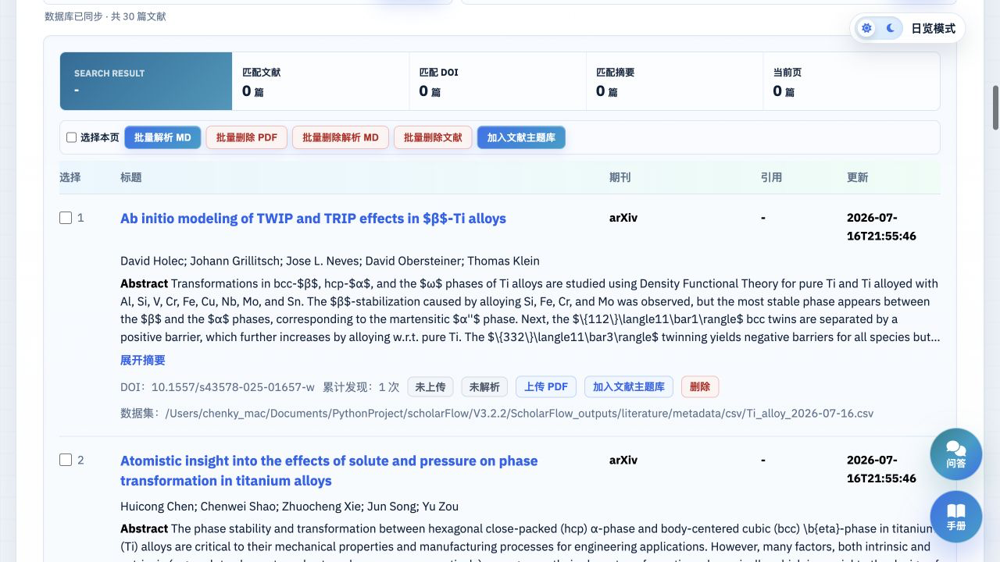

V3.2.2 已关闭 `pdf_url` 自动下载接口。软件不会因为元数据中存在 PDF 链接就自动抓取文件，用户需要点击“上传 PDF”选择本地文件。

建议只上传以下 PDF：

- 开放获取或明确允许下载的论文
- 用户本人、所在机构或图书馆已合法订阅的论文
- 作者主页、机构仓储或预印本平台公开提供的版本
- 用户拥有处理权限的自有文档

上传时会检查 PDF 文件头和文件大小，单个文件上限为 80 MB。PDF 保存在本机，不会由 LiterNexus 主动上传到第三方；但后续使用云端模型生成回答或综述时，相关文本片段会发送到用户配置的模型服务。

## 7. PDF 全文解析

V3.2.2 使用 Marker 生成 Markdown，使用 PyMuPDF 提取逐页文本，再把 Markdown chunk 映射回 PDF 页码。两者用途不同，因此即使使用 Marker，也仍需要安装 `pymupdf`。

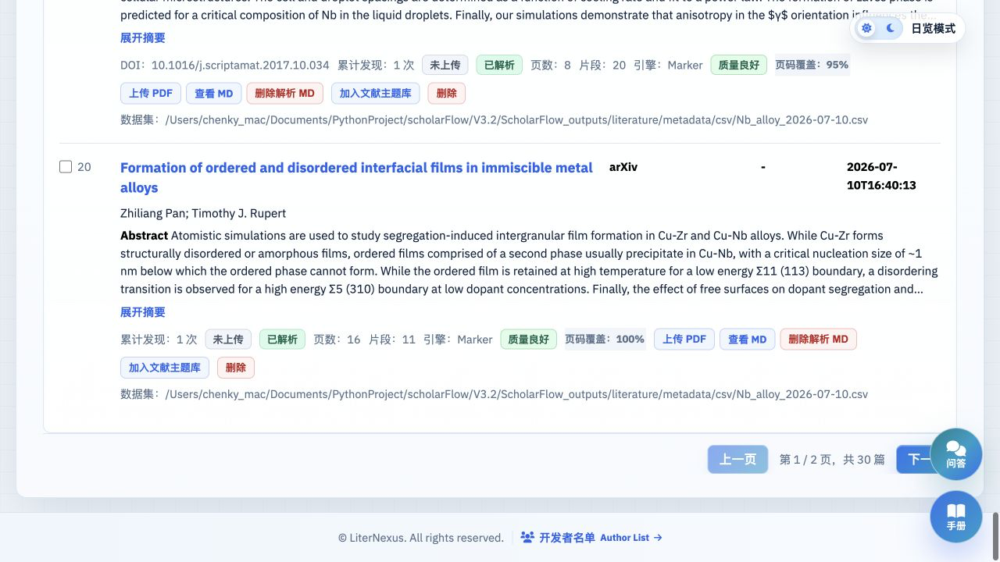

### 7.1 操作步骤

1. 确认文献已经写入文献数据库。
2. 点击“上传 PDF”，选择本地 PDF。
3. 点击“解析 MD”。
4. 等待预检、Marker 解析、页码映射、质量评估和切块入库完成。
5. 检查卡片上的片段数、页码覆盖率和解析质量。
6. 点击“查看 MD”核对正文、公式、表格、图片和章节结构。

已解析文献再次点击“重新解析 MD”会强制运行 Marker；普通“解析 MD”在缓存有效时会直接使用现有结果。

### 7.2 解析质量

| 状态 | 含义 |
| --- | --- |
| 质量良好 | 文本长度、页码覆盖率和映射置信度达到较好水平 |
| 质量警告 | 全文可使用，但部分页码、页面文本或分块需要人工检查 |
| 质量较差 | 正文过短、映射不足或 PDF 可能主要由扫描图片组成 |

页码映射只保留连续、单调的可靠页区间。无法可靠判断时页码会留空，不会为了显示页码而猜测。

### 7.3 修改 Markdown

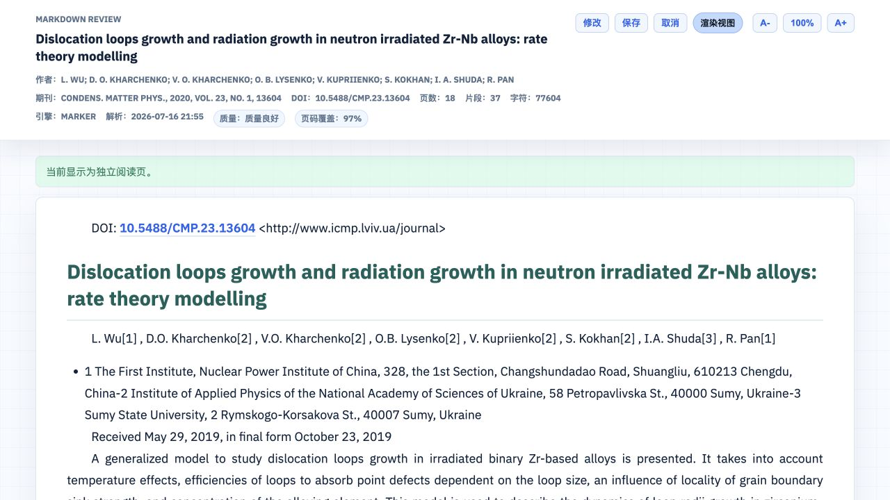

“查看 MD”页面支持渲染视图、源码修改、保存、取消和字体缩放。保存修改后会重新切块、重建 FTS，并使内容已变化的旧向量失效。若已启用混合检索，应回到知识问答设置中点击“更新语义索引”。

### 7.4 Marker 可选环境变量

```bash
MARKER_ENABLE_OCR=1                 # 扫描版 PDF 启用 OCR
MARKER_ENABLE_MULTIPROCESSING=1     # 允许 Marker 多进程
MARKER_USE_LLM=1                    # 启用 Marker 的 LLM 模式
MARKER_DISABLE_IMAGE_EXTRACTION=1   # 不提取图片
MARKER_KEEP_DECORATIVE_IMAGES=1     # 保留可能被识别为装饰图的图片
MARKER_TIMEOUT_SECONDS=1800         # Marker 超时时间
MARKER_PREFLIGHT_TIMEOUT_SECONDS=180
MARKER_SKIP_PREFLIGHT=1             # 跳过解析前预检
```

OCR 和 LLM 模式可能增加运行时间、硬件占用或外部服务调用，应根据文档类型开启。

## 8. 全文检索

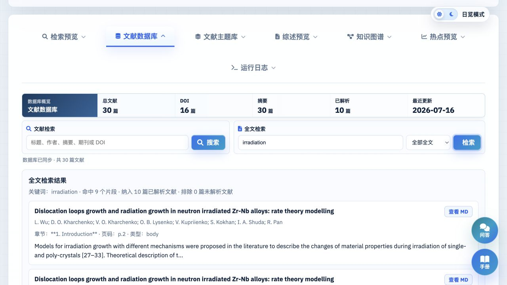

文献数据库顶部提供独立的“全文检索”。它只搜索 `parse_status=parsed` 且已经写入 chunk 的文献。

### 操作步骤

1. 在文献列表中勾选目标文献，或把范围切换为“全部全文”。
2. 输入关键词。
3. 点击“检索全文”。
4. 在结果卡片中查看文献、章节、页码、片段类型和命中摘要。
5. 点击结果中的 Markdown 或 PDF 入口核对原文。

全文检索使用本地 SQLite FTS5，不调用语言模型，也不产生模型费用。未解析文献不会参与全文检索。

## 9. 文献主题库

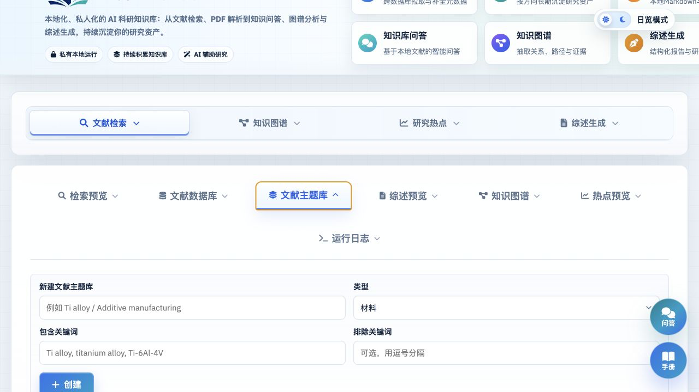

主题库用于按材料体系、方法工艺、项目专题或自定义规则组织文献。创建时可设置名称、类型、包含关键词和排除关键词。

文献可在数据库列表中手动加入主题库，也可通过主题库规则匹配。主题库可作为知识问答范围和知识图谱数据源。

删除文献数据库记录时，对应主题库关系会一并移除；删除主题库不会删除文献数据库中的原始文献。

## 10. 知识问答

点击页面右下角“知识问答”，进入独立问答工作区。

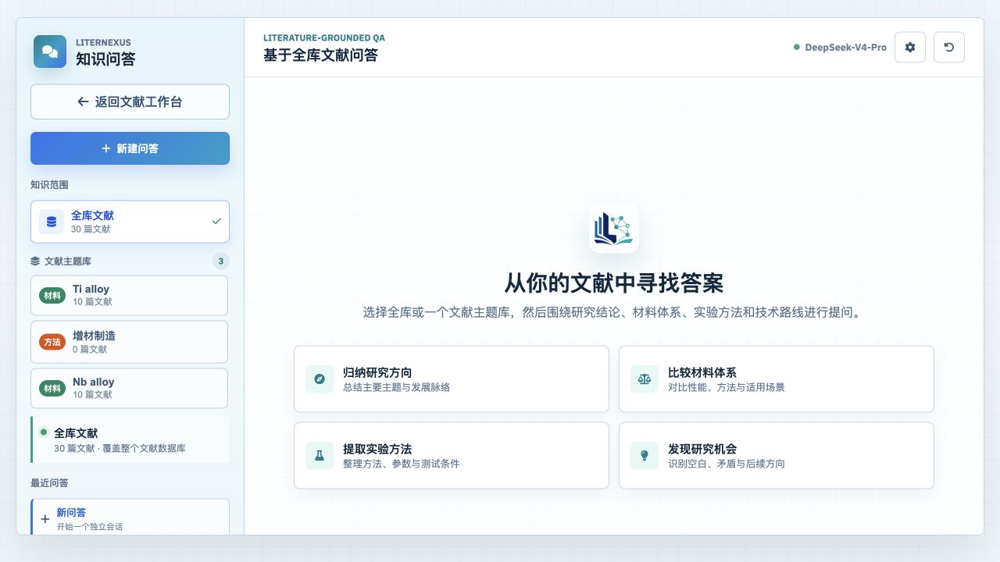

### 10.1 基本流程

1. 在左侧选择“全库文献”或一个文献主题库。
2. 点击右上角齿轮，配置回答模型和检索方式。
3. 点击“测试连接”。
4. 保存配置。
5. 输入问题并发送。
6. 展开回答下方的引用卡片，核对文献、章节、页码和原文片段。

适合的问题包括研究方向归纳、材料体系比较、实验方法与参数提取、公式解释、跨文献差异和研究空白分析。

问答范围可以包含摘要和已解析全文。只有摘要的文献仍可能提供摘要证据；需要页码、公式、图表或实验细节时，应先上传并解析 PDF。

### 10.2 回答模型

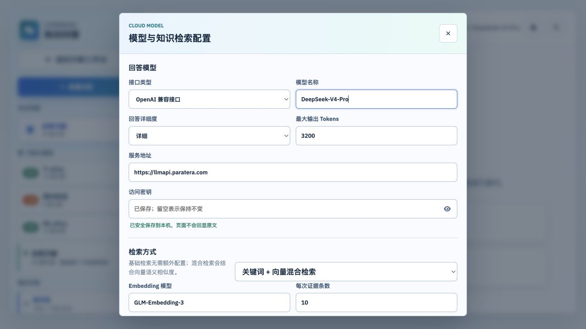

| 字段 | 说明 |
| --- | --- |
| 接口类型 | OpenAI 兼容接口或本地 Ollama |
| 模型名称 | 模型服务实际提供的模型标识 |
| 回答详细度 | 简洁、标准或详细 |
| 最大输出 Tokens | 512 至 8000 |
| 服务地址 | API 根地址，例如 OpenAI-compatible `/v1` 地址 |
| 访问密钥 | OpenAI 兼容接口必填；Ollama 不要求 |

当前版本支持通过 Ollama 运行本地回答模型，但尚未提供从 `models/` 目录直接加载语言模型的内置推理引擎。

## 11. 检索、Embedding 与 Reranker

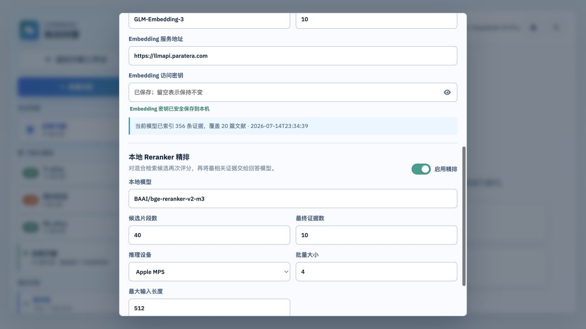

### 11.1 本地关键词检索

“本地关键词检索”是默认模式，不需要 Embedding 服务。系统结合全文 FTS、摘要匹配、章节权重以及公式、图片、表格意图检索证据。

### 11.2 混合检索

“关键词 + 向量混合检索”会合并关键词结果与向量相似度结果。启用时需要填写：

- Embedding 模型
- Embedding 服务地址；留空时使用回答模型服务地址
- Embedding 访问密钥；留空时使用回答模型密钥
- 每次最终证据条数，范围 4 至 20

配置完成后点击“更新语义索引”。索引按当前全库或主题库范围增量更新：内容未变化的向量会复用，内容变化、来源删除、维度异常或损坏的向量会刷新或清理。不同 Embedding 模型的索引可以共存。

直接修改 Markdown、更新摘要或切换 Embedding 模型后，应再次更新语义索引。

### 11.3 本地 Reranker

本地 Reranker 用于对召回候选重新评分。默认模型为：

```txt
BAAI/bge-reranker-v2-m3
```

首次使用步骤：

1. 勾选“启用精排”。
2. 选择 `auto`、`mps` 或 `cpu`。
3. 设置候选片段数、批量大小和最大输入长度。
4. 点击“部署本地精排”。
5. 等待模型下载和冒烟测试完成。

模型保存在：

```txt
LiterNexus_outputs/models/reranker/
```

`auto` 在 Apple Silicon 上优先使用 MPS，否则使用 CPU。模型只在首次问答时载入内存；精排失败时系统会降级使用原检索排序，并在问答元数据中记录降级原因。

部署过程需要访问 Hugging Face。部署完成后，推理使用本地模型文件。

## 12. 引用与问答历史

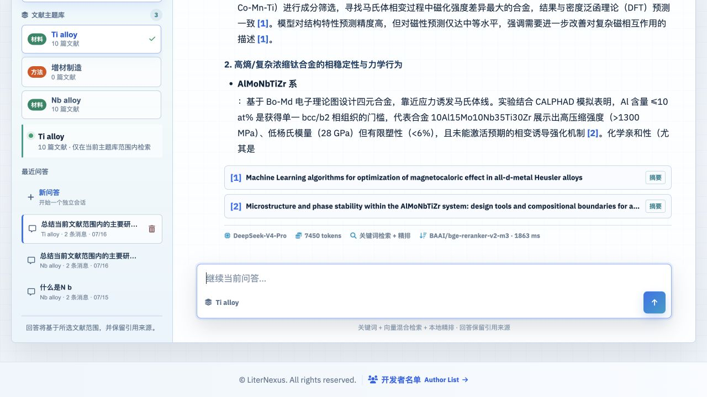

模型回答必须遵守引用白名单：

- 引用只能指向本次检索提供的摘要或全文 chunk
- 正文 `[1] [2]` 必须与引用数组连续且完全一致
- 每条引用必须包含明确的 claim 和非空证据正文
- 证据充分的回答至少需要一个引用
- 证据不足时必须明确写出“现有文献证据不足”

引用卡片会显示文献题名、摘要或全文标签、章节、页码和原文证据。全文引用可跳转到 Markdown 全文；页码为空表示系统无法可靠映射，应以原 PDF 人工核对。

问答会话保存在：

```txt
LiterNexus_outputs/knowledge_qa/knowledge_qa.sqlite
LiterNexus_outputs/knowledge_qa/history/*.md
```

左侧“最近问答”可重新打开会话。删除会话会同时删除数据库中的消息、引用以及对应 Markdown 历史文件。

## 13. 综述生成

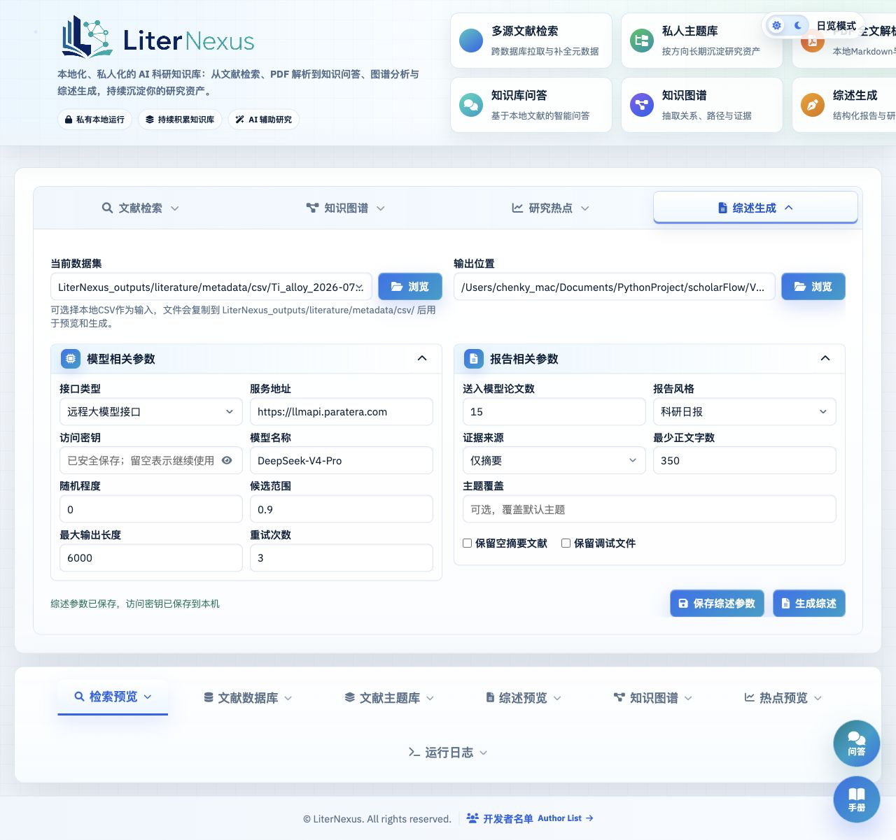

综述生成需要独立配置模型，不自动读取知识问答配置。

### 模型参数

| 字段 | 说明 |
| --- | --- |
| 接口类型 | 本地 Ollama 或 OpenAI 兼容接口 |
| 服务地址、模型名称 | 必填 |
| 访问密钥 | 远程 OpenAI 兼容接口必填 |
| 随机程度、候选范围 | 控制生成随机性 |
| 最大输出长度 | 控制模型输出上限 |
| 重试次数 | JSON 或引用校验失败后的重试次数 |

### 报告参数

| 字段 | 说明 |
| --- | --- |
| 送入模型论文数 | 控制提示词中的论文数量 |
| 报告风格 | 科研日报、综述摘要、技术路线图、专利机会或研究建议 |
| 证据来源 | 仅摘要、仅全文证据、摘要和全文证据 |
| 最少正文字数 | 报告正文最低长度 |
| 主题覆盖 | 手动限定报告主题 |
| 保留空摘要文献 | 摘要为空时是否仍参与 |
| 保留调试文件 | 保存 prompt 和原始模型输出，可能包含敏感内容 |

## 14. 综述预览

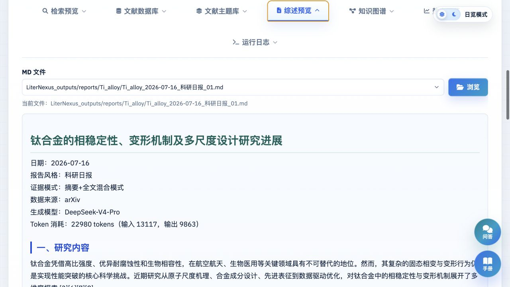

报告默认保存到：

```txt
LiterNexus_outputs/reports/<主题名>/
```

预览区支持 Markdown、JSON、TXT 和 PDF。报告可能包含研究内容、主要发现、证据、科学问题、方法体系和参考文献。AI 生成内容必须结合引用原文人工复核。

## 15. 知识图谱

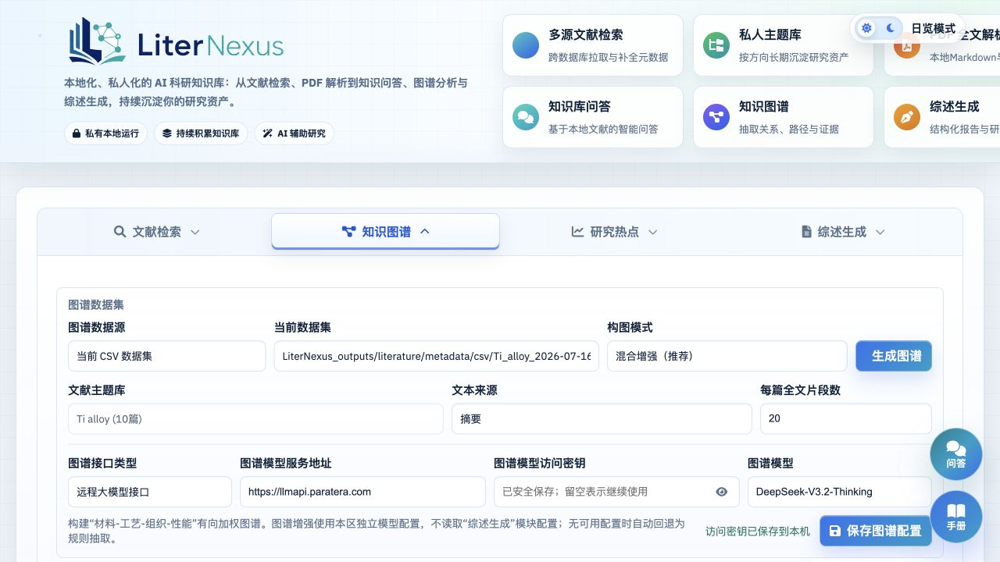

图谱数据源支持当前 CSV、文献主题库和全库文献库；文本来源支持摘要、全文片段或两者结合。

| 构图模式 | 说明 |
| --- | --- |
| 规则抽取 | 本地规则抽取，不调用模型 |
| 大模型优先 | 主要使用模型提取关系 |
| 混合增强 | 合并规则关系和模型关系 |

图谱增强使用本模块的独立模型配置。配置不完整或调用失败时会回退到规则抽取。

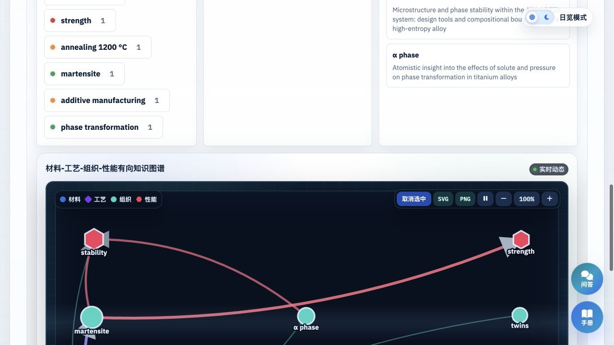

图谱预览支持节点与有向边、节点类型、关系证据、高频术语、缩放、重置以及 SVG/PNG 导出。图谱关系是抽取结果，不应直接视为已经验证的科学因果关系。

## 16. 研究热点

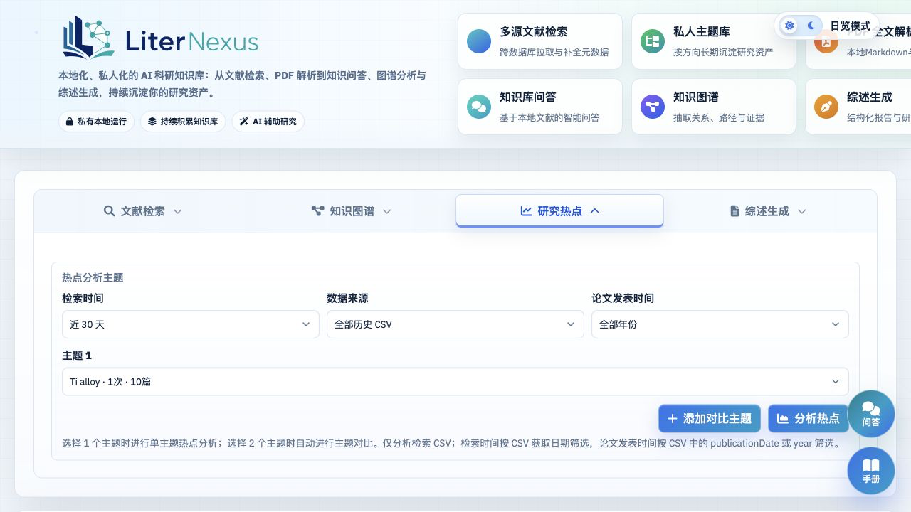

研究热点只分析检索 CSV，不读取问答、全文索引或已生成综述。

可设置检索获取时间、论文发表年份、当前 CSV 或全部历史 CSV，以及一个或两个对比主题。系统会先按 DOI 或标题去重，再统计关键词、方法、材料体系、方向簇、作者和机构。

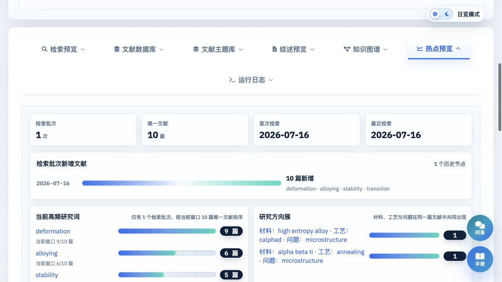

至少存在两个检索批次时，系统会计算近期升温词以及新增活跃作者、机构；只有一个批次时展示当前活跃度。点击热点条目可查看相关论文和来源 CSV。

## 17. 运行日志

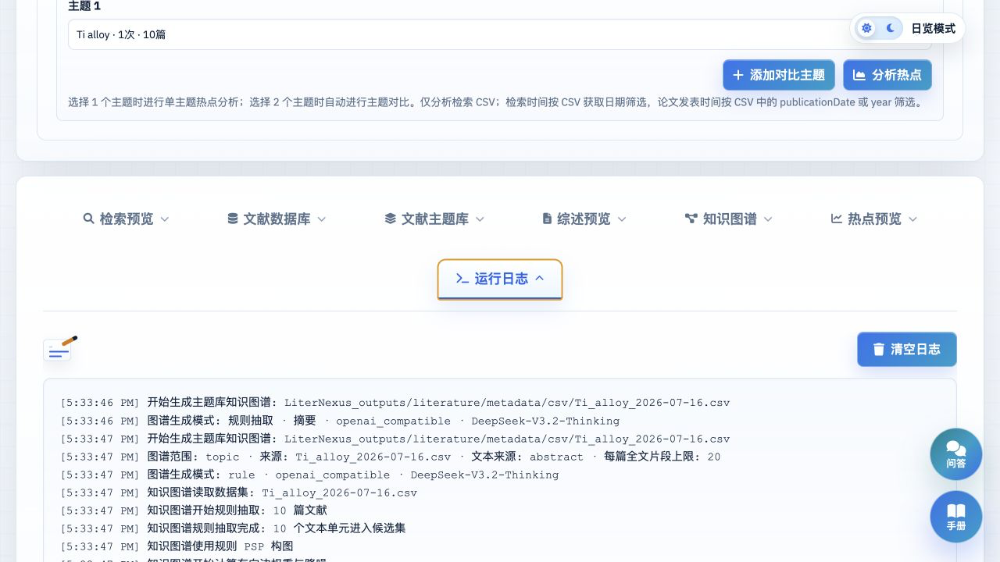

运行日志记录检索、多源补全、PDF 上传与解析、综述生成、图谱生成和热点分析状态。遇到任务失败时，应先复制日志中的完整错误，再检查依赖、文件路径、模型配置和网络状态。

知识问答的连接、索引和 Reranker 状态主要显示在知识问答设置窗口和消息元数据中。

## 18. 数据目录与升级迁移

```txt
LiterNexus_outputs/
├── config/
│   ├── knowledge_qa.json
│   ├── knowledge_graph.json
│   └── report_generation.json
├── knowledge_qa/
│   ├── knowledge_qa.sqlite
│   └── history/
├── literature/
│   ├── metadata/
│   │   ├── csv/
│   │   └── json/
│   ├── pdfs/
│   ├── marker/
│   └── literature_library.sqlite
├── models/
│   └── reranker/
└── reports/
```

配置文件可能包含模型服务地址和访问密钥，程序会尽量以仅当前用户可读写的权限保存。备份或分享项目时仍应把整个 `LiterNexus_outputs/` 视为私有数据。

从旧品牌版本升级时，如果存在 `ScholarFlow_outputs/` 且不存在 `LiterNexus_outputs/`，程序会把旧目录迁移为 `LiterNexus_outputs/`。如果两个目录同时存在，当前版本使用 `LiterNexus_outputs/`，不会自动合并两套数据库。

早期目录 `Literature_search_results/` 和 `report_outputs/` 仍用于兼容读取部分历史 PDF、Marker 资源和报告。建议迁移前先备份 SQLite、PDF 和 Markdown。

## 19. 常见问题

### 为什么使用 Marker 还需要 PyMuPDF？

Marker 负责生成结构化 Markdown；PyMuPDF 负责逐页提取文本和真实页数，以便把 Markdown chunk 映射回 PDF 页码。缺少 PyMuPDF 时无法完成当前解析闭环。

### Marker 解析失败或很慢

检查 `marker_single` 是否可执行、PDF 是否损坏、磁盘空间是否充足，以及运行日志中的预检错误。扫描版 PDF 可尝试 `MARKER_ENABLE_OCR=1`。首次运行 Marker 或本地模型时可能需要准备模型缓存。

### 全文检索没有结果

确认文献状态为“已解析”、片段数大于 0，并根据需要切换“已选文献/全部全文”。全文检索不会搜索尚未解析的 PDF。

### 知识问答提示模型未配置

打开齿轮设置，填写回答模型服务地址和模型名称。OpenAI 兼容接口还需要访问密钥；本地 Ollama 不需要密钥。

### 混合检索没有语义结果

确认检索方式为“关键词 + 向量混合检索”，Embedding 地址、密钥和模型均已填写，并点击“更新语义索引”。切换模型或修改全文后需要再次更新。

### Reranker 无法部署

确认已安装 `torch`、`transformers` 和 `huggingface-hub`，能够访问 Hugging Face，并有足够磁盘空间。MPS 不可用时选择 `auto` 会回退到 CPU。

### 为什么回答显示证据不足？

当前范围内可能只有元数据、摘要过短、全文未解析或检索不到足够证据。先核对知识范围，再补充 PDF、检查解析质量或改用更明确的关键词提问。

### 是否已经支持把本地语言模型和 Embedding 权重放进 `models/` 直接运行？

尚未完整支持。V3.2.2 直接管理的是本地 Reranker；回答模型可通过本地 Ollama 接入，Embedding 通过 OpenAI-compatible `/embeddings` 服务接入。后续内置本地语言模型和 Embedding 推理时，应继续沿用当前模型生命周期和索引完整性机制。

## 20. 隐私、安全与发布检查

- 不要提交 `LiterNexus_outputs/`、`ScholarFlow_outputs/` 或早期兼容输出目录。
- 不要提交 PDF、Markdown、SQLite、问答历史、调试 prompt 或私有报告。
- 不要在截图、日志或源码中暴露访问密钥、邮箱和内部模型地址。
- 使用云端模型时，确认文献文本发送行为符合论文许可、机构政策和模型服务条款。
- 检索结果、页码映射、问答引用、图谱关系和 AI 综述都需要人工复核。
- 对外发布前检查 `.gitignore`、打包清单和 PyInstaller `datas`，避免把用户数据或模型权重打包进安装程序。
